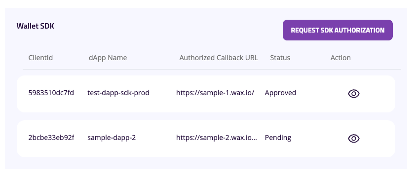
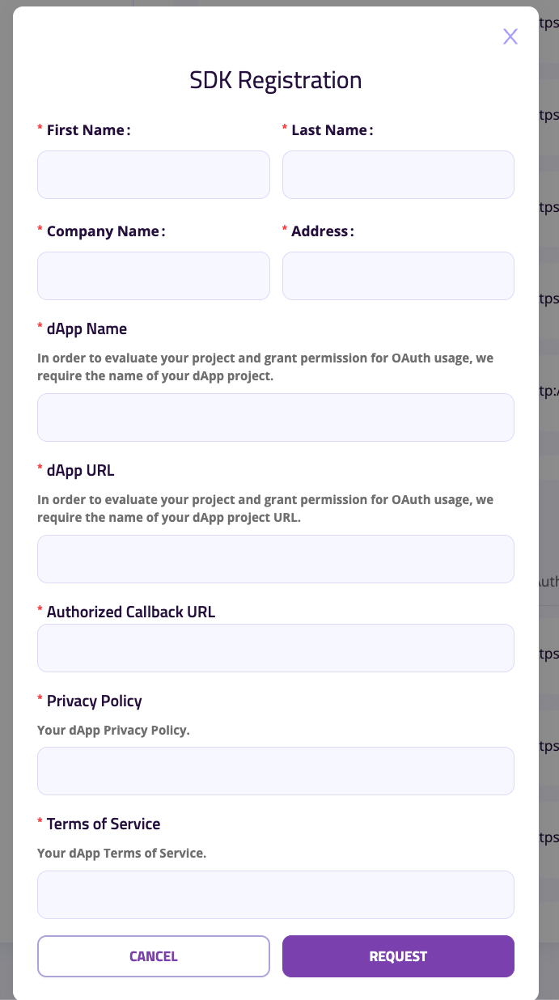
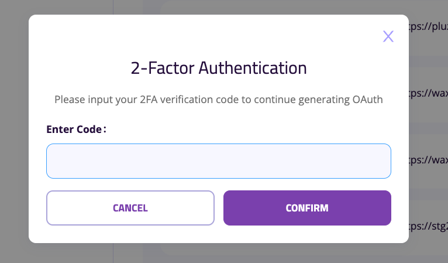

# dApp Backend

## Implementation

**Example code**

```ts
/***********
 * Routers *
 ***********/
const express = require("express");
const { getSDKSingleUseToken } = require("./path/to/your/controller");
const router = express.Router();
router.post("/sdk-token", getSDKSingleUseToken);
module.exports = router;


/**************
 * Controller *
 **************/
const axios = require("axios");
const config = require("config"); // Assume you have a config module for configurations

const getSDKSingleUseToken = async (req, res) => {
  try {
    // Extract client_id from the request body
    const clientId = req.body.client_id || config.get("services.mycloudwallet.clientId");

    if (!clientId) {
      return res.status(400).json({ error: "client_id is required" });
    }

    // Prepare the payload
    const payload = {
      ...req.body,
      client_secret: config.get("services.mycloudwallet.clientSecret"), // Fetch client secret from config
    };

    // Construct the swap token endpoint URL
    const sdkAuthorizationEndpoint = config.get("services.mycloudwallet.sdkAuthorizationEndpoint");
    const endpoint = `${sdkAuthorizationEndpoint}/dapp-sdk/sut/${clientId}`;

    // Make the POST request using Axios
    const response = await axios.post(endpoint, payload, {
      headers: {
        "Content-Type": "application/json",
      },
    });

    // Return the response body
    res.status(200).json(response.data);
  } catch (error) {
    // Handle errors
    if (error.response) {
      // Error response from the external API
      res.status(error.response.status).json(error.response.data);
    } else {
      // Internal server error
      res.status(500).json({ error: "An internal server error occurred" });
    }
  }
};

module.exports = { getSDKSingleUseToken };
```

**Configuration**
```json
{
  "services": {
    "mycloudwallet": {
      "sdkAuthorizationEndpoint": "https://login-api.mycloudwallet.com/v1/wcw", // Base API URL
      "clientSecret": "your-client-secret", // Client secret
      "clientId": "your-client-id" // Optional: Default client ID if not provided in request
    }
  }
}
```

## dApp SDK API Key
1. Access [My Cloud Wallet - Developer Settings](https://www.mycloudwallet.com/settings/developer-settings)
2. Requesting for SDK - Authorization

3. Filling SDK Authorization Request Form

4. Authorized Callback URL: URL of your DApp Backend
5. Input 2FA Code (setup one if you didn't setup yet)

6. Pending for approval

7. Once Approval/ Deny , there will be a notification appear on top header, right corner
8. Once request is approved, click on the request item again to view the secret key. plz aware that secret key **can be viewed only once**!

