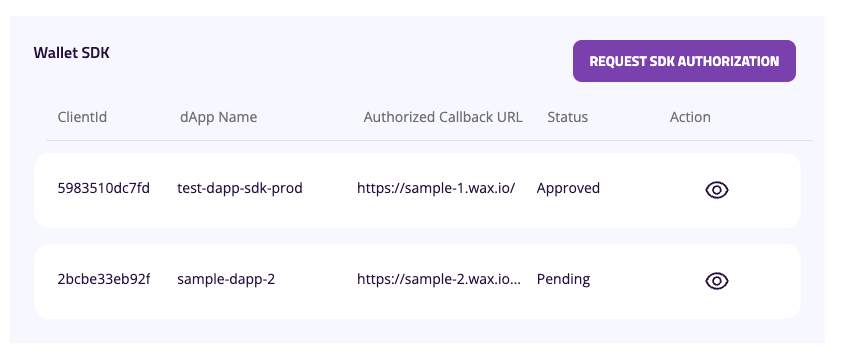
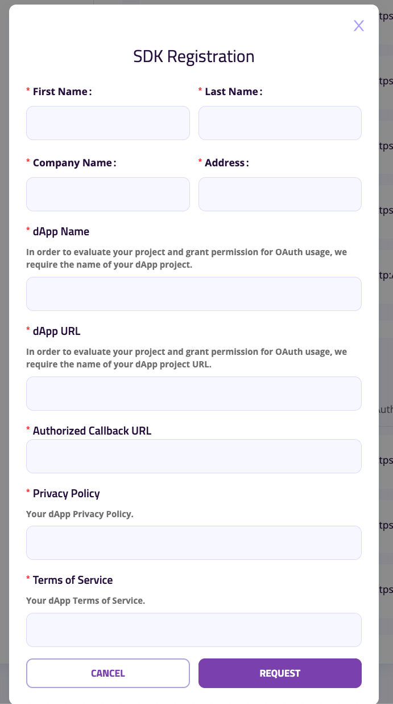
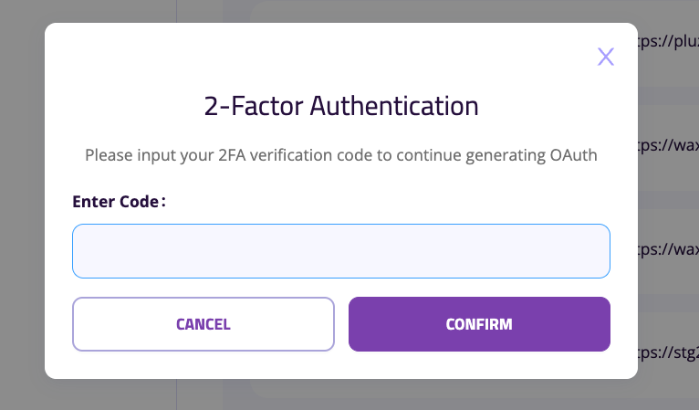
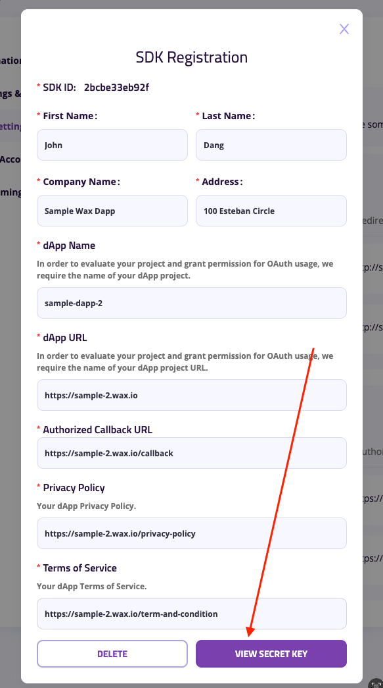
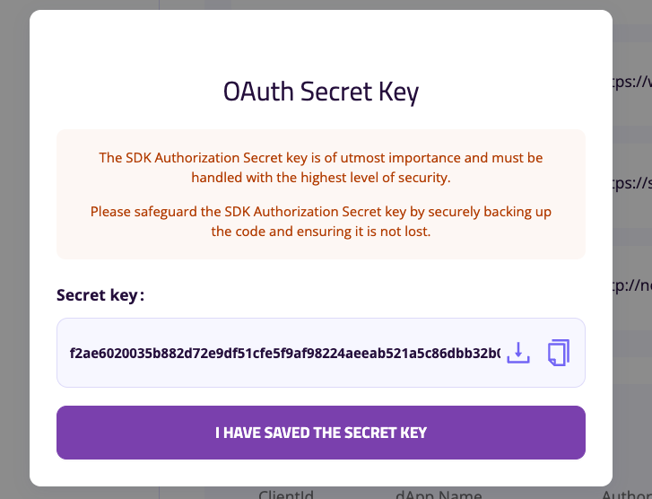

# dApp Backend

## Implementation

**Example code**

```csharp
using System;
using System.Net.Http;
using System.Text;
using System.Text.Json;
using System.Threading.Tasks;
using Microsoft.Extensions.Configuration;

public class CloudWalletController
{
    private readonly IConfiguration _configuration;
    private readonly HttpClient _httpClient;

    public CloudWalletController(IConfiguration configuration)
    {
        _configuration = configuration;
        _httpClient = new HttpClient();
    }

    [HttpPost("sdk-token")]
    public async Task<IActionResult> GetSDKSingleUseToken([FromBody] TokenRequest request)
    {
        try
        {
            // Extract client_id from the request body or use default from config
            var clientId = request.ClientId ?? _configuration["MyCloudWallet:ClientId"];

            if (string.IsNullOrEmpty(clientId))
            {
                return BadRequest(new { error = "client_id is required" });
            }

            // Prepare the payload
            var payload = new
            {
                client_id = clientId,
                client_secret = _configuration["MyCloudWallet:ClientSecret"]
            };

            // Construct the swap token endpoint URL
            var sdkAuthorizationEndpoint = _configuration["MyCloudWallet:SdkAuthorizationEndpoint"];
            var endpoint = $"{sdkAuthorizationEndpoint}/dapp-sdk/sut/{clientId}";

            // Make the POST request
            var content = new StringContent(
                JsonSerializer.Serialize(payload),
                Encoding.UTF8,
                "application/json"
            );

            var response = await _httpClient.PostAsync(endpoint, content);
            var responseContent = await response.Content.ReadAsStringAsync();

            if (!response.IsSuccessStatusCode)
            {
                return StatusCode((int)response.StatusCode, JsonSerializer.Deserialize<object>(responseContent));
            }

            return Ok(JsonSerializer.Deserialize<object>(responseContent));
        }
        catch (Exception ex)
        {
            return StatusCode(500, new { error = "An internal server error occurred" });
        }
    }
}

public class TokenRequest
{
    public string ClientId { get; set; }
}
```

**Configuration**
```json
{
  "MyCloudWallet": {
    "SdkAuthorizationEndpoint": "https://login-api.mycloudwallet.com/v1/wcw", // Base API URL
    "ClientSecret": "your-client-secret", // Client secret
    "ClientId": "your-client-id" // Optional: Default client ID if not provided in request
  }
}
```

## dApp SDK API Key
1. Access [My Cloud Wallet - Developer Settings](https://www.mycloudwallet.com/settings/developer-settings)
2. Requesting for SDK - Authorization

3. Filling SDK Authorization Request Form

4. Authorized Callback URL: URL of your DApp Backend
5. Input 2FA Code (setup one if you didn't setup yet)

6. Pending for approval

7. Once Approval/ Deny , there will be a notification appear on top header, right corner

8. Once request is approved, click on the request item again to view the secret key. plz aware that secret key **can be viewed only once**!

