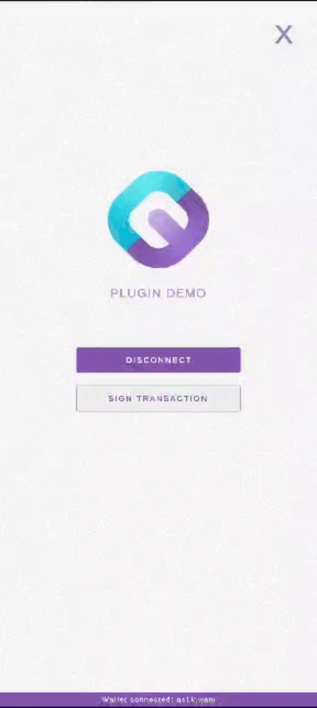
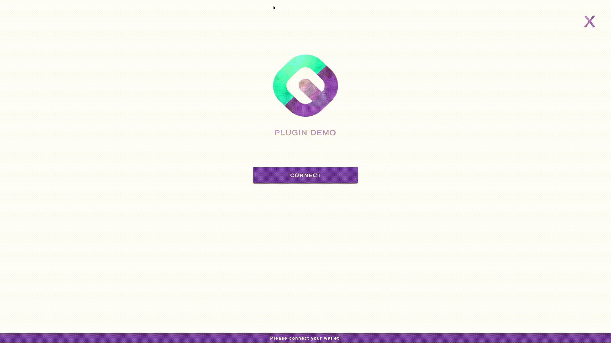
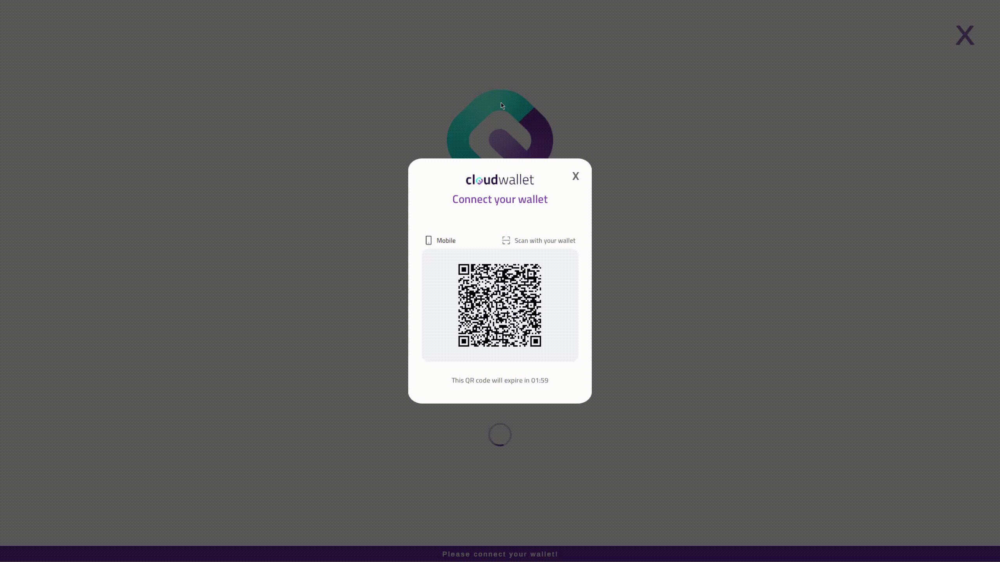
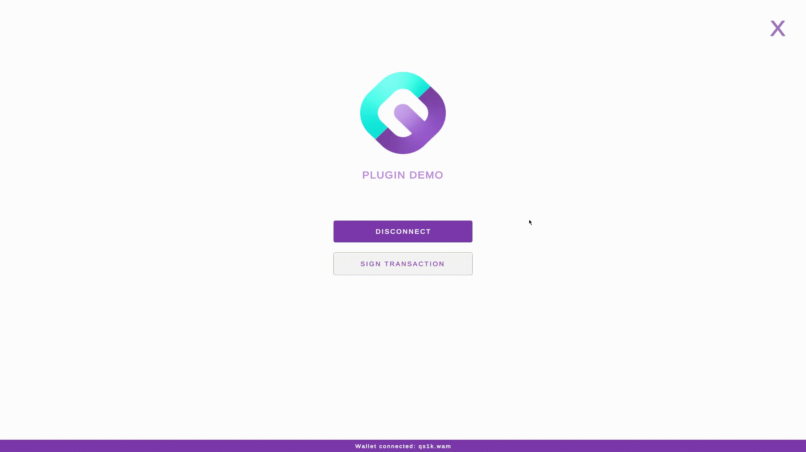

# Cloud Wallet Unity SDK DEMO

## Project Structure

Contains the demo implementation of the Cloud Wallet plugin to showcase its features and usage.

| Folder               | Description                                             |
|----------------------|---------------------------------------------------------|
| `Assets/Scenes` | Contains the main scene of the Demo. |
| `Assets/CloudWalletDemo` | Contains the assets and scripts for the demo implementation. |
| `Assets/CloudWalletDemo/Plugin/Android` | Contains the AndroidManifest.xml file, which is important to allow the Plugin work. |

## Demo of each functionality

### Wallet Connection

#### Mobile Platforms

| Activation | Deactivation |
|-----------------------------------------------------------------------------------------------------|------------------------------------------------------------------------------------------------|
|  | |

#### Non-Mobile Platforms

| Activation | Activation with time out |Deactivation |
|--------------------------------------------------------------------------------------------------------------|---------------------------------------------------------------------------------------------------|-------------------------------------------------------------------------|
|          |  |                          |

### Sign Transaction

#### Mobile Platforms
| Approved | Rejected |
|---------------------------------------------------------------------------------------------------------|----------------------------------------------------------------------------------------------------------|
|  |  |

#### Non-Mobile Platforms
| Approved | Rejected |
|----------------------------------------------------------------------------------------------------------|-----------------------------------------------------------------------------------------------------------|
|  |  |