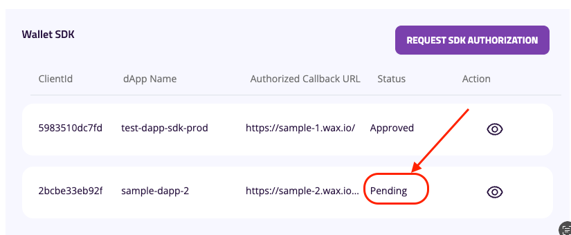
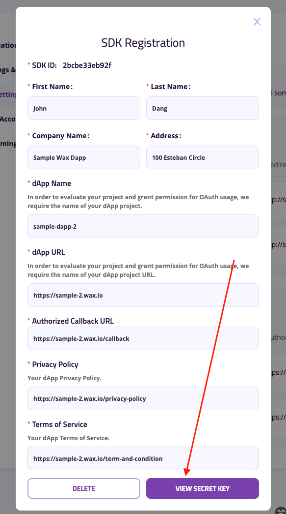

# Backend de la dApp

## Implementación

**Código de ejemplo**

```ts
/***********
 * Rutas *
 ***********/
const express = require("express");
const { getSDKSingleUseToken } = require("./path/to/your/controller");
const router = express.Router();
router.post("/sdk-token", getSDKSingleUseToken);
module.exports = router;


/**************
 * Controlador *
 **************/
const axios = require("axios");
const config = require("config"); // Se asume que tienes un módulo de configuración

const getSDKSingleUseToken = async (req, res) => {
  try {
    // Extraer client_id del cuerpo de la solicitud
    const clientId = req.body.client_id || config.get("services.mycloudwallet.clientId");

    if (!clientId) {
      return res.status(400).json({ error: "client_id es requerido" });
    }

    // Preparar el payload
    const payload = {
      ...req.body,
      client_secret: config.get("services.mycloudwallet.clientSecret"), // Obtener el client secret de la configuración
    };

    // Construir la URL del endpoint para el swap token
    const sdkAuthorizationEndpoint = config.get("services.mycloudwallet.sdkAuthorizationEndpoint");
    const endpoint = `${sdkAuthorizationEndpoint}/dapp-sdk/sut/${clientId}`;

    // Realizar la solicitud POST usando Axios
    const response = await axios.post(endpoint, payload, {
      headers: {
        "Content-Type": "application/json",
      },
    });

    // Devolver el cuerpo de la respuesta
    res.status(200).json(response.data);
  } catch (error) {
    // Manejar errores
    if (error.response) {
      // Error de respuesta de la API externa
      res.status(error.response.status).json(error.response.data);
    } else {
      // Error interno del servidor
      res.status(500).json({ error: "Ocurrió un error interno en el servidor" });
    }
  }
};

module.exports = { getSDKSingleUseToken };
```

**Configuración**
```json
{
  "services": {
    "mycloudwallet": {
      "sdkAuthorizationEndpoint": "https://login-api.mycloudwallet.com/v1/wcw", // URL base de la API
      "clientSecret": "tu-client-secret", // Secreto del cliente
      "clientId": "tu-client-id" // Opcional: ID de cliente por defecto si no se proporciona en la solicitud
    }
  }
}
```

## Clave API del SDK de la dApp
1. Accede a [My Cloud Wallet - Configuración de Desarrollador](https://www.mycloudwallet.com/settings/developer-settings)
2. Solicitar autorización para el SDK

3. Rellenar el formulario de solicitud de autorización del SDK

4. URL de Callback autorizada: URL de tu backend de la dApp
5. Introduce el código 2FA (configura uno si aún no lo has hecho)

6. Pendiente de aprobación

7. Una vez aprobada o denegada la solicitud, aparecerá una notificación en la parte superior derecha

8. Una vez aprobada la solicitud, haz clic de nuevo en el elemento de la solicitud para ver la clave secreta. ¡Ten en cuenta que la clave secreta **solo puede verse una vez**!

